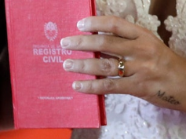

# Security is not a Game

What was the MSN email of the company in charge of the wedding cybersecurity?

Given is this file

## Todos

Looking for the picture on google you can find some hints about the wedding from leonel messi.
Some further investigation into the wedding and cybersecurity you can find the page [How the wedding of Lionel Messi was successfully shielded from information leaks by security expert Fernando Villares](https://cryptoworldaffairs.com/2018/12/10/how-the-wedding-of-lionel-messi-was-successfully-shielded-from-information-leaks-by-security-expert-fernando-villares/).
After that - it went dark... I found the company, but all further steps felt like running against a wall.

 - Wayback Machine
 - Twitter
 - Facebook
 - the compandy webpage (InteliX Ingeniería)
 

