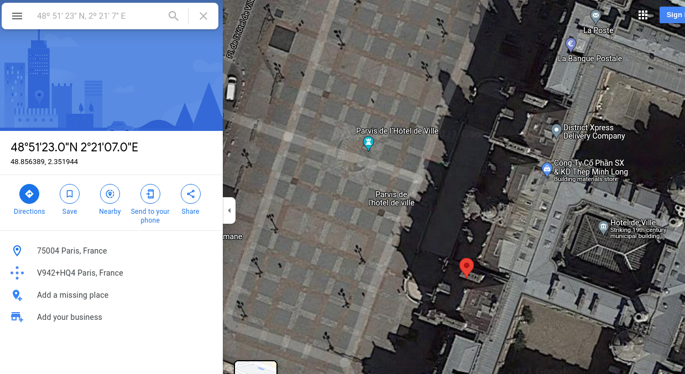
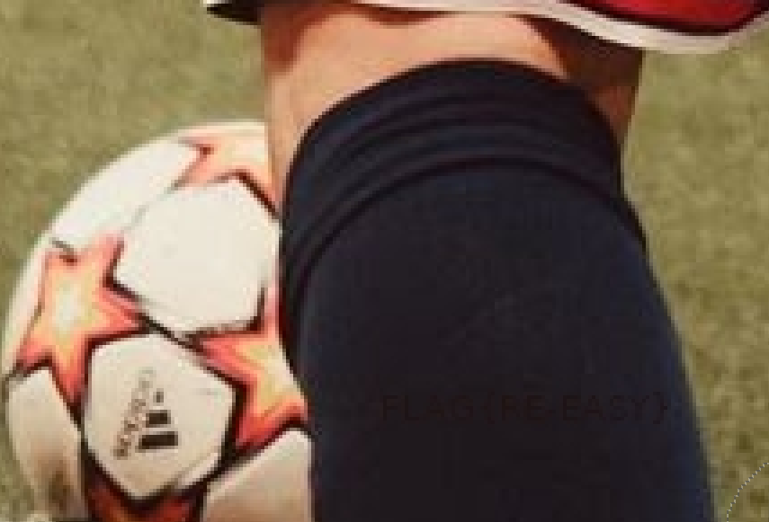

# Deep

Bielsa: 'A man with new ideas is a madman, until his ideas triumph'

Given is this foto:


## Todos

Okay guys - this one is an easy one, but I did not solved that by my own!

### My personal rabbitholes

Disclaimer: I couldn't solve the challenge and had to bang my head on the edge of the table for hours after solving it. 

 - file
   Seems like a normal jpeg file

```shell
file messi2.jpeg
messi2.jpeg: JPEG image data, JFIF standard 1.01, resolution (DPI), density 300x300, segment length 16, Exif Standard: [TIFF image data, little-endian, direntries=7, orientation=upper-left, xresolution=98, yresolution=106, resolutionunit=2, software=GIMP 2.10.24, datetime=2021:11:08 16:44:21], comment: "latitud: 48\302\272 51' 23'' N, longitud: 2\302\272 21' 7'' E", progressive, precision 8, 1080x1349, components 3
```

 - Strings
   No further infos
 - exiftools
   Oh - a comment

> latitud: 48º 51' 23'' N, longitud: 2º 21' 7'' E

This brings us to paris:


Long story short - it's a dead end! (I searched for an hour :-))
Because of reaching the midnighthour I decided to go to bed.

----

### Solution

Let's talk about the real solution. Just look at the left leg on the picture under the knee.



There is the flag... easy right... I hate myself :)

> flag{RE-EASY}
