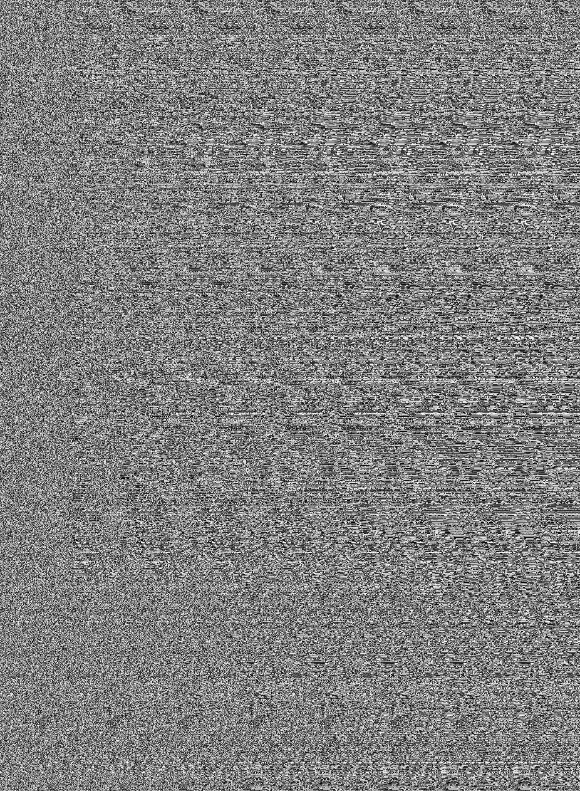

# Noise

Messi: 'When the year starts, the objective is to win with all the team, personal records are secondary'

## Todos

Given was this picture .

In this stego challenges the first approach is to check the file type and look for some strings.

```shell
$ ~ # file challenge.png
challenge.png: PNG image data, 926 x 1262, 8-bit grayscale, non-interlaced
```
That looks normal... okay strings then. For a better overview I like to write the output to a file.

```shell
$ ~ # strings challenge.png > challenge.png_strings
```

But in this file, we also find nothing. Okay my secret weapon then... I found this tool over a youtube video. `stegosolve` is a java tool, which brings some nice features.

```shell
java -jar stegsolve.jar
```
I load the image an checked all layers and channels. But still nothing... okay then lets have a look in the offset! For this you need to use the option "Analyse > Stegogram Solver".
Look at offset 84. 

> add Images


> flag {M3ss1rrvvv333!} 
